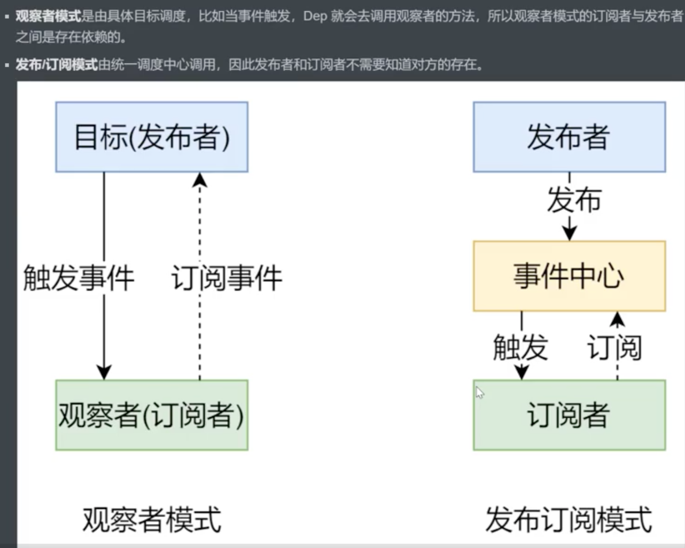
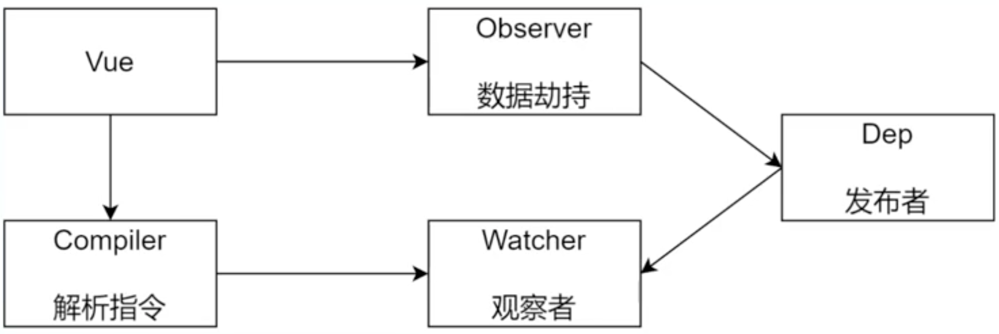
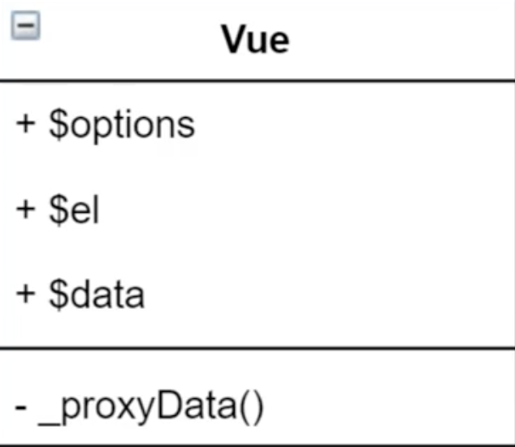
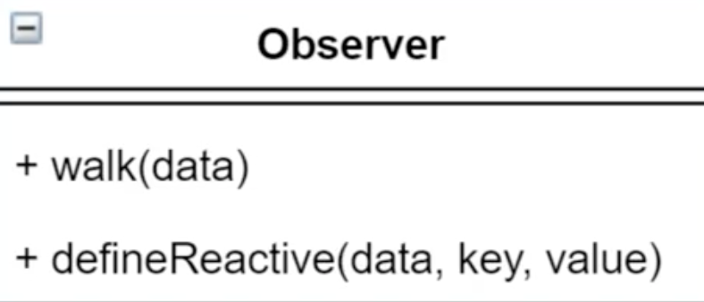
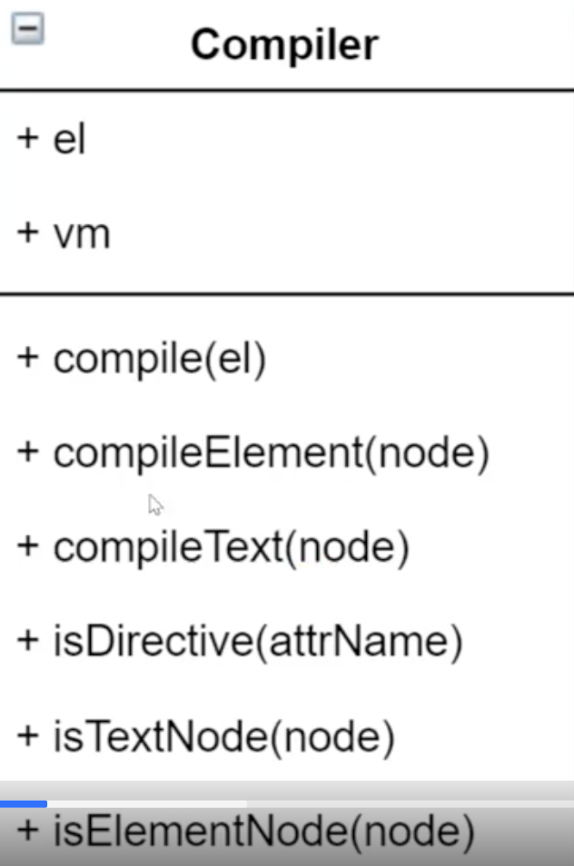
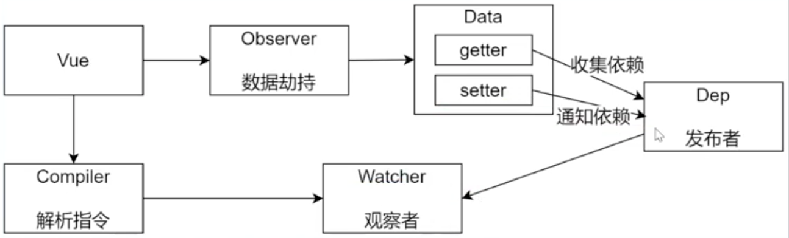
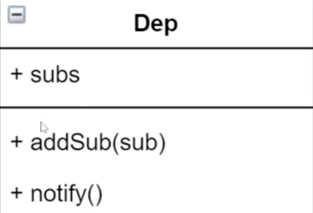
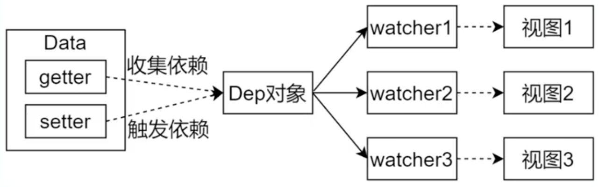
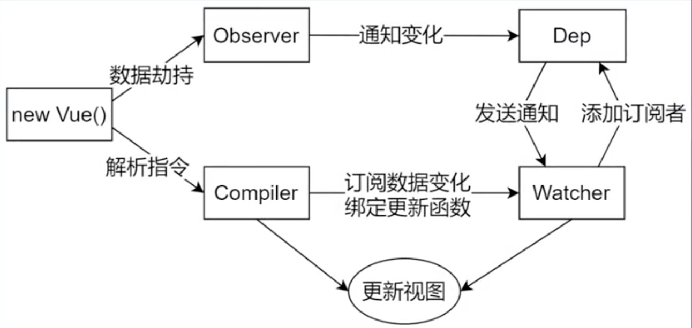

### 手写Vue.js响应式实现

###### 1、概念

- **数据驱动**

  - 数据响应式

    修改数据时，视图会自动更新，避免繁琐DOM操作

  - 双向绑定

    数据改变，视图改变；视图改变，数据也随之改变

    可以使用v-model在表单元素上创建双向数据绑定

  - 数据驱动是Vue最独特的特性之一

    开发过程中只需关注数据本身，不需要关注数据是如何渲染到视图。主流的MVVM框架都实现了数据驱动，不需要繁琐操作DOM

- **数据响应式的核心原理**

  Vue2.X和Vue3.0中的响应式实现原理不同

  - **Vue2.X**

    当你把一个普通的 JavaScript 对象传入 Vue 实例作为 `data` 选项，Vue 将遍历此对象所有的 property，并使用 [`Object.defineProperty`](https://developer.mozilla.org/zh-CN/docs/Web/JavaScript/Reference/Global_Objects/Object/defineProperty) 把这些 property 全部转为 [getter/setter](https://developer.mozilla.org/zh-CN/docs/Web/JavaScript/Guide/Working_with_Objects#定义_getters_与_setters)。`Object.defineProperty` 是 ES5 中一个无法 shim(降低处理) 的特性，这也就是 Vue 不支持 IE8 以及更低版本浏览器的原因。

    【基于Object.defineProperty实现】

    ```html
    <body>
        <!-- ************************* 实现功能：msg内容改变，div内容随之改变 ************************* -->
        <div id="app">
            hello
        </div>
        <script>
            // 模拟Vue中的data选项
            let data = {
                msg:'hello',
                count:0
            }
            // 模拟 Vue 实例
            let vm = {}
            //  *************************  将data中的属性全部转化为getter/setter
            proxyData(data);
    
            function proxyData(){
                // 遍历data对象的所有属性
                Object.keys(data).forEach(key => {
                    // 把data中的属性，转换成 vm 的getter/setter
                    Object.defineProperty(vm,key,{
                        enumerable:true,
                        configurable:true,
                    
                        get:function(){
                            console.log('get: '+ data[key]);
                            return data[key];
                        },
                        set:function(newValue){
                            console.log('set: ' + newValue);
                            if(newValue === data[key]){
                                return;
                            }
                            data[key] = newValue;
                            // 数据更改，更新DOM的值
                            document.getElementById('app').textContent = data[key];
                        }
    
                    });
                });
            }
    
        </script>
    </body>
    </html>
    ```

  - **Vue3.0**

    Vue3中的数据劫持使用的是ES6中新增的代理对象Proxy

    Proxy直接监听对象，而非属性（Vue2中循环遍历data的属性，对应每个属性在vm实例上设置getter/setter，进行数据劫持），因此在把多个属性转化为getter/setter时不需要循环。

    Proxy是ES6中新增的、IE不支持、性能由浏览器优化（性能比defineProperty好）

    【 基于Proxy对象实现】

    ```javascript
    				// 模拟Vue实例
            // vm对象是data对象的代理对象，访问vm的成员就是访问data的成员，在其中加入数据劫持，做一些干预操作，比如数据变化就更新DOM内容
            let vm = new Proxy(data,{
                // 执行代理行为的函数
    
                // 当访问vm的成员会执行
                get:function(target,key){
                    console.log('get,key:'+ target[key]);
                    return target[key];
                },
    
                // 当设置vm的成员时会执行
                set:function(target,key,newValue){
                    console.log('set,key:' + newValue);
                    if(target[key] === newValue){
                        return
                    }
                    target[key] = newValue;
                    document.getElementById('app').textContent = target[key];
                }
            });
    ```

- **发布订阅模式和观察者模式**

  2种设计模式，在Vue中有各自的应用场景

  - **发布订阅模式**

    Vue中的事件机制是基于发布/订阅模式的

    $on：注册事件（订阅）

    $emit：触发事件（发布）

    em：事件中心

  - **观察者模式**

    - 观察者（订阅者）—— Watcher

      Update()：当事件发生时，具体要做的事情

    - 目标（发布者）—— Dep

      subs数组：存储所有的观察者

      addSub()：添加观察者

      notify()：当事件发生时，调用所有观察者的update方法

    - 没有事件中心

  - **两者区别**

    

###### 2、Vue响应式原理模拟

- **整体结构**

  5种类型

  

  - Vue：把data中的成员注入到Vue实例，并且把data中的成员转化为getter/setter
  - Observer：数据劫持，把data中的成员转化为响应式数据，对data的所有属性进行监听，如有变动，可拿到最新值并通知Dep
  - Compiler：操作DOM，对插值表达值、指令进行解析
  - Watcher：实例化时将自己添加到dep对象，数据变化时dep通知所有watcher实例更新视图
  - Dep：在data属性对应的get方法中收集依赖（将watcher对象添加到subs数组），在set方法中通知依赖（调用所有watcher实例的update方法）

  【注意】

  （1）一个data里的属性对应一个dep，一个dep对应多个watcher

  （2）Watcher类的实例化应该和编译插值表达式/指令在一起（哪里使用data里的数据，哪里添加watcher）

  （3）Dep类的实例化和Observer类中对data数据响应式处理在一起

- **1）Vue**

  - 功能

    - 负责接收初始化参数（选项）——一个对象
    - 负责把data中的成员注入到Vue实例，转化为getter/setter
    - 调用observer监听data所有属性的变化
    - 调用compiler解析指令/插值表达式

  - 结构

    

- **2）Observer**

  - 功能

    - 负责把data选项中的属性转换为响应式数据（getter/setter）
    - 如果data中某个属性也是对象，把该属性转换为响应式数据
    - 数据变化发送通知 

  - 结构

    

- **3）Compiler**

  - 功能

    - 负责编译模版，解析指令/插值表达式

    - 负责页面的首次渲染

    - 当数据变化后重新渲染视图

      Vue中使用虚拟DOM，在此作简化不适用虚拟DOM，直接做DOM操作

  - 结构

    

- **4）Dep（Dependency）**

  

  - 功能

    - 在getter中收集依赖，添加观察者（watcher）
    - 在setter中通知依赖，通知观察者去更新视图 

  - 结构

    

- **5）Watcher**

  

  - 功能

    - 当数据变化时触发依赖，dep通知所有的watcher实例更新视图
    - 自身实例化的时候往dep对象中添加自己

  - 结构

    

  

###### 3、调试

- 首次渲染过程
- 数据改变更新视图过程



  

页面首次加载时通过compiler更新视图

数据变化时通过watcher更新视图

###### 4、Vue响应式原理总结

- Vue在初始化实例时，由Observer类遍历data里所有属性，并实例化Dep类，一个属性一个Dep用来管理该属性下的所有Watcher（如果同一个属性在DOM节点中多次使用会创建多个Watcher），并使用Object.defineProperty()方法把这些属性都转为getter/setter。
- 在Compile中，初始化视图并实例化Watcher，将更新函数放到Watcher的回调上。初始化视图时，会读取属性值，触发get，在get中将创建的Watcher交由dep管理，即将watcher添加到对应deps数组中。
- 当修改数据时，会触发set，调用dep的notify，执行该dep管理下的所有Watcher的回调，重新render当前组件，生成新的虚拟DOM树。Vue框架会遍历并对比新虚拟DOM树和旧虚拟DOM树种每个节点的差别，并记录下来，最后，加载操作，将所有记录的不同点，局部修改到真DOM树上。

