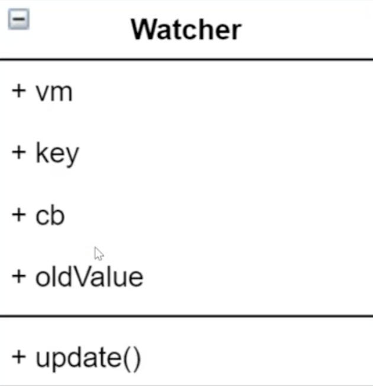

### 【Vue】

##### **一、nodejs、npm、Vue、Webpack间的关系**

- nodejs

  node.js是[JavaScript](http://lib.csdn.net/base/javascript)的一种运行环境，是对Google V8引擎进行的封装。是一个服务器端的javascript的解释器。

- npm

  nodejs中含有npm，比如说你安装好nodejs，你打开cmd输入npm -v会发现输出npm的版本号，说明npm已经安装好。

  其实npm是nodejs的包管理器（package manager）。我们在Node.js上开发时，会用到很多别人已经写好的javascript代码，如果每当我们需要别人的代码时，都根据名字搜索一下，下载源码，解压，再使用，会非常麻烦。于是就出现了包管理器npm。大家把自己写好的源码上传到npm官网上，如果要用某个或某些个，直接通过npm安装就可以了，不用管那个源码在哪里。并且如果我们要使用模块A，而模块A又依赖模块B，模块B又依赖模块C和D，此时npm会根据依赖关系，把所有依赖的包都下载下来并且管理起来。

- 

##### **二、VueJS概念**

一种前端流行框架。框架提供了一些规则，我们需要遵循其规则才能使用其功能（工具）搭建项目

渐进式：项目可以某一部分遵循vue进行开发，逐渐地可扩展到整个项目 

##### **三、Vue核心特性**

- **数据驱动视图**（数据变化导致视图变化）

  数据：网页中的数据信息

  视图：数据对应的标签结构

  - 数据变化会自动更新到对应元素中，无需手动操作DOM，这种行为成为单向数据绑定

  - 对于输入框等可输入元素，可设置双向数据绑定

    双向数据绑定是在数据单向绑定的基础上，可自动将元素输入内容更新给数据，实现**数据**与**元素内容（视图内容）**的**双向绑定**

  **数据驱动视图实现原理**

  Vue.js的数据驱动视图是基于MVVM模型实现的

  - Model层，代表数据
  - View层，代表视图模版（元素结构）
  - ViewModel层，代表业务逻辑代码（控制器，VM是V和M之间的调度者，实现了数据的双向绑定）

  优点：解放了DOM操作；View和Model处理分离，降低代码耦合度

  缺点：Bug调试难度增大，有可能在数据端有可能在视图端

- **组件化开发**

  组件：自定义的HTML标签，允许自定义封装结构、自定义封装样式、自定义封装JS代码，复用时书写自定义标签名即可

  提高开发效率（不用复制代码，写标签名即可）和可维护性（修改标签定义处即可）

##### 四、Vue安装

**Vue的本质是一个JS文件**，3种安装方式

- 本地引入：下载到本地使用

  开发版本

  生产版本

- CDN引入：通过script标签链接线上vue.js的地址

- npm安装

  ```
  npm install vue
  npm install vue@2.6.12
  ```

##### 五、基础语法

###### **1、Vue实例**

```javascript
// 创建一个Vue的实例
// new出来的这个vm对象就是我们MVVM中的VM调度者
var vm = new Vue({
  配置对象
});
```

###### **2、基础选项**

- **el 选项**

  选取一个DOM元素作为Vue实例的挂载目标，不能是html/body元素

  只有挂载元素内部才会被Vue处理，外部是普通的HTML元素

  Vue实例所控制的这个元素区域代表MVVM中的View层

  挂载完毕后可以通过 `vm.$el` 访问这个dom元素

  创建vue实例时没有挂载目标，可以在创建完毕后通过 `vm.$mount()`挂载

- **插值表达式**

  挂载元素可以使用Vue.js的模版语法，模版中可以通过插值表达式为元素进行动态内容设置，写法为{{}}

  插值表达式只能书写在标签内容区域，可以与其它内容混合

  内部只能书写JavaScript表达式，不能书写语句

- **data 选项**

  存放的是Vue实例中要用到的数据，值为对象类型

  - 在vue实例中，如果想要获取data上的数据，或者调用methods中的方法，必须通过this.数据属性名 或 this.方法名 进行访问。 this指new出来的vm实例对象

  - 在vue实例外面，可以通过以下访问

    ```javascript
    vm.$data.数据属性名
    vm.数据属性名
    ```

  data中的数据可以直接在视图中通过插值表达式访问

  data中的数据为响应式数据，发生改变时，视图会自动更新（**数据驱动视图**）

  注意：data中存在数组时，索引操作与length操作无法自动更新视图，需要借助Vue.set()方法替代操作

  ```javascript
  Vue.set(vm.arra,0,'新内容');
  ```

- **methods 选项**

  methods属性定义了当前Vue实例所有可用的方法

  方法内部的this指vm实例对象

###### **3、指令**

指令的本质是HTML自定义属性，在Vue中是给框架识别的一种标记，给元素执行特别处理

Vue.js的指令是以v-开头的自定义属性

- **内容处理**

  **v-once**：使元素内部的插值表达式只生效一次（不会随数据变化而发生变化）

  **v-text**：元素内容整体替换为指定纯文本数据

  ```html
  <p v-text="content">p标签中原有内容</p>
  可以赋值data中的数据实现数据动态绑定
  ```

  **v-html**：元素内容整体替换为指定的HTML文本

- **属性绑定**

  **v-bind**：动态绑定HTML属性

  与插值表达式类似，v-bind也允许使用表达式

  ```php+HTML
  <!-- v-bind用于绑定属性 -->
  <input type="button" name="" v-bind:title="mytitle + '字符串拼接'" value="按钮">
  <!-- v-bind 简写形式: -->
  <input type="button" name="" :title="mytitle + '字符串拼接'" value="按钮">
  ```

  如果需要一次绑定多个属性，则可以直接绑定对象

  ```html
  <p v-bind="attrObj">p标签内容</p>
  Vue实例的data里定义attrObj
  attrObj:{
  	id:'box',
  	title:'示例内容',
  	'data-title':'属性名里有-时要用单引号括起来'
  }
  ```

  **CLass绑定**

  直接单个属性绑定

  ```html
  <p :class="cls"></p>
  ```

  多个属性绑定

  ```html
  赋值数组
  <p :class="['a','b',{c:true}]"></p>     // a/b是静态类名
  赋值对象
  <p :class="{b:isB, c:isC, 'class-id':true}"></p> // 对象的属性是类名，可加引号也可不加引号。如果属性里面有-，必须加单引号
  ```

  **Style绑定**

  ```html
  <p :style="styleObj"></p>
  <p :style="[styleObj1,styleObj2]"></p>
  ```

- **渲染指令**

  **v-for**：用于遍历数据渲染结构，如数组、对象、单个数值

  ```html
  <!-- 遍历数组 -->
  <!-- <p v-for="item in arr1">{{item}}</p> -->
  <p v-for="(item,i) in arr1">索引值：{{i}}------数值为：{{item}}</p>
  <p v-for="(item,i) in arr2">索引值：{{i}}------id:{{item.id}}-----name:{{item.name}}</p>
  
  <!-- 循环对象 -->
  <p v-for="(value,key) in obj1">{{key}}-----{{value}}</p>
  
  <!-- 迭代数字从1开始-->
  <p v-for="count in 10">{{count}}</p>
  <p v-for="(count,index) in 10">索引值:{{index}}------值:{{count}}</p>
  ```

  【注意点1】一般 v-for 和 key（利用v-bind绑定 :key）联合使用。1）避免出现问题：元素结构变了对应的元素内容没变，这是因为Vue考虑渲染性能尽可能将相同的结构进行修补 而不是移除旧的创建新的，只是在旧结构上修改元素结构，未修改元素内容。2）Vue内部实现中可以通过:key提高渲染效率

   key 值：指定唯一的字符串/数字类型

  【注意点2】通过<template>标签设置模版占位符，可以将部分元素/内容整体操作

  <template>标签不是一个真正的DOM元素，只是表示一块区域

  ```html
  <div id="app">
    <template v-for="item in items">
      <span>标签内容</span>
      <span>标签内容</span>
    </template>
  </div>
  ```

  **v-show**

  v-show的特点：每次不会重新进行DOM的删除和创建操作，只是切换了元素的display：none样式

  【注意点】<template>元素无法使用v-show指令，因为其不是一个真正的元素，没有display属性

  **v-if**

  根据条件控制删除/创建元素

  ```html
  <p v-if="false"></p>
  <p v-else-if="false"></p>
  <p v-else-if="false"></p>
  <p v-else></p>     // 最后一个不必写条件，上面条件都不满足则默认执行
  ```

  【注意点1】v-if作用的元素标签内具有相同元素结构时，也应该加 :key ,原理和v-for相同

  【注意点2】出于性能考虑，应避免将v-if与v-for应用于同一标签：因为在Vue中v-for的优先级比v-if高，若v-if为false，那么v-for的执行将无意义。

- **事件处理**

  **v-on**

  ```html
  <!-- v-on 简写形式@ -->
  <input type="button" name="" :title="mytitle + '字符串拼接'" value="按钮" @mouseover="show">
  ```

  当事件程序代码较多时，可以在methods中设置函数，并设置为事件处理程序。

  设置为事件处理程序后，可以从参数中接收事件对象

  当需要传参并且需要使用事件对象时，需要在视图中通过 $event 访问事件对象

- **表单输入绑定**

  **v-model**：对于表单元素，可设置双向数据绑定（数据驱动视图、视图驱动数据）

  input(radio,text,address,email...) select checkbox textarea

  ```html
  文本
  <input type="text" name="" v-model="msg">
  选择框
  <select v-model="opt">
   <option>+</option>
   <option>-</option>
   <option>*</option>
   <option>/</option>
  </select>
  ```

  checkbox复选框是单选时绑定的是布尔值（选/不选），多选时绑定的是字符串值，存储到数组里。

###### **4、修饰符**

以点开头的指令后缀，用于给当前指令设置特殊操作

- **事件修饰符**

  .prevent修饰符——阻止事件造成的标签默认行为

  .stop修饰符——用于阻止事件传播（冒泡）

  .once修饰符——设置事件只触发一次

- **按键修饰符**

  按键码指的是将按键的按键码作为按键修饰符使用，以标识按键的操作方式。

  ```html
  <input type="text" @keyup.a="fn" />
  <input type="text" @keyup.45="fn" />
  ```

- **系统修饰符**

  系统按键：ctrl/alt/shift，通常与其它按键组合使用，单独点击无作用

  ```html
  <input type="text" @keyup.ctrl.c="fn" />
  ```

  单独点击起作用，需：

  ```html
  <input type="text" @keyup.ctrl.exact="fn" />
  ```

- **鼠标修饰符**

  设置点击事件由鼠标哪个按键来完成

  .right

  .left

  .middle

- **v-model修饰符**

  .trim 用于自动过滤用户输入内容首尾两端的空格

  .lazy  把v-model频繁的数据更新变为制定操作才数据更新（更改双向绑定的触发时机），类似于change，失焦之后才改变

  .number 用于自动将用户输入的值转为数值型，如无法被parseFloat()转换，则返回原始内容

##### 六、组件

###### 1、组件概念

组件是可复用的 Vue 实例，且带有一个名字：在这个例子中是 `<button-counter>`。

因为组件是可复用的 Vue 实例，所以它们与 `new Vue` 接收相同的选项，例如 `data`、`computed`、`watch`、`methods` 以及生命周期钩子等。仅有的例外是像 `el` 这样根实例特有的选项。

```javascript
// 定义一个名为 button-counter 的新组件
Vue.component('button-counter', {
  data: function () {
    return {
      count: 0
    }
  },
  template: '<button v-on:click="count++">You clicked me {{ count }} times.</button>'
})
```

我们可以在一个通过 `new Vue` 创建的 Vue 根实例中，把这个组件作为自定义元素来使用：

```html
<div id="components-demo">
  <button-counter></button-counter>
</div>
```

```javascript
new Vue({ el: '#components-demo' })
```

###### 2、组件复用

```html
<div id="components-demo">
  <button-counter></button-counter>
  <button-counter></button-counter>
  <button-counter></button-counter>
</div>
```

注意当点击按钮时，每个组件都会各自独立维护它的 `count`。因为你每用一次组件，就会有一个它的新**实例**被创建。

- **一个组件的 `data` 选项必须是一个函数**

  每个实例可以维护一份被返回对象的独立的拷贝

  如果 Vue 没有这条规则，组件复用时一个组件修改数据，其它组件都会被修改（都指向同一个对象）

###### 3、组件注册

- 全局注册

  ```javascript
  Vue.component('component-a', { /* ... */ })
  Vue.component('component-b', { /* ... */ })
  Vue.component('component-c', { /* ... */ })
  
  new Vue({ el: '#app' })
  ```

  ```html
  <div id="app">
    <component-a></component-a>
    <component-b></component-b>
    <component-c></component-c>
  </div>
  ```

- 局部注册

  全局注册往往是不够理想的。比如，如果你使用一个像 webpack 这样的构建系统，全局注册所有的组件意味着即便你已经不再使用一个组件了，它仍然会被包含在你最终的构建结果中。这造成了用户下载的 JavaScript 的无谓的增加。

  在这些情况下，可以通过一个普通的 JavaScript 对象来定义组件：

  ```javascript
  var ComponentA = { /* ... */ }
  var ComponentB = { /* ... */ }
  var ComponentC = { /* ... */ }
  ```

  然后在 `components` 选项中定义你想要使用的组件：

  ```javascript
  new Vue({
    el: '#app',
    components: {
      'component-a': ComponentA,
      'component-b': ComponentB
    }
  })
  ```

  对于 `components` 对象中的每个 property 来说，其 property 名就是自定义元素的名字，其 property 值就是这个组件的选项对象。

###### 4、通过Prop向子组件传递数据

prop 是可以在组件上注册的一些自定义 attribute（自定义HTML属性）。

当一个值传递给一个 prop attribute 的时候，它就变成了那个组件实例的一个 property。

```
父组件和子组件之间的传值和传方法-父向子传值 方法一
（1）父组件可以在引用子组件的时候，通过属性绑定（v-bind:）的形式，把需要传递给子组件的数据，以自定义属性绑定的形式，传递到子组件内部，供子组件使用，例如：
	<comp1 :parentmsg='msg'></comp1>
（2）在子组件的模版对象中
props:['parentmsg'], // 把父组件传递过来的parentmsg属性，先在props数组中定义一下，这样才能使用该数据
```

例子：属性 tittle接受来自父组件的值

```javascript
Vue.component('blog-post', {
  props: ['title'],
  template: '<h3>{{ title }}</h3>'
})
```

也可以不接收父组件的值，直接给自定义html属性title赋值：

```html
<blog-post title="My journey with Vue"></blog-post>
<blog-post title="Blogging with Vue"></blog-post>
<blog-post title="Why Vue is so fun"></blog-post>
```

一开始不清楚要渲染的具体内容，可以使用 `v-bind` 来动态绑定html属性，传递 prop

一个典型的应用中，你可能在 `data` 里有一个博文的数组：

```javascript
new Vue({
  el: '#blog-post-demo',
  data: {
    posts: [
      { id: 1, title: 'My journey with Vue' },
      { id: 2, title: 'Blogging with Vue' },
      { id: 3, title: 'Why Vue is so fun' }
    ]
  }
})
```

并想要为每篇博文渲染一个组件：

```javascript
<blog-post
  v-for="post in posts"
  v-bind:key="post.id"
  v-bind:title="post.title"
></blog-post>
```

##### 七、手写Vue.js实现

###### 1、概念

- **数据驱动**

  - 数据响应式

    修改数据时，视图会自动更新，避免繁琐DOM操作

  - 双向绑定

    数据改变，视图改变；视图改变，数据也随之改变

    可以使用v-model在表单元素上创建双向数据绑定

  - 数据驱动是Vue最独特的特性之一

    开发过程中只需关注数据本身，不需要关注数据是如何渲染到视图。主流的MVVM框架都实现了数据驱动，不需要繁琐操作DOM

- **数据响应式的核心原理**

  Vue2.X和Vue3.0中的响应式实现原理不同

  - **Vue2.X**

    当你把一个普通的 JavaScript 对象传入 Vue 实例作为 `data` 选项，Vue 将遍历此对象所有的 property，并使用 [`Object.defineProperty`](https://developer.mozilla.org/zh-CN/docs/Web/JavaScript/Reference/Global_Objects/Object/defineProperty) 把这些 property 全部转为 [getter/setter](https://developer.mozilla.org/zh-CN/docs/Web/JavaScript/Guide/Working_with_Objects#定义_getters_与_setters)。`Object.defineProperty` 是 ES5 中一个无法 shim(降低处理) 的特性，这也就是 Vue 不支持 IE8 以及更低版本浏览器的原因。

    【基于Object.defineProperty实现】

    ```html
    <body>
        <!-- ************************* 实现功能：msg内容改变，div内容随之改变 ************************* -->
        <div id="app">
            hello
        </div>
        <script>
            // 模拟Vue中的data选项
            let data = {
                msg:'hello',
                count:0
            }
            // 模拟 Vue 实例
            let vm = {}
            //  *************************  将data中的属性全部转化为getter/setter
            proxyData(data);
    
            function proxyData(){
                // 遍历data对象的所有属性
                Object.keys(data).forEach(key => {
                    // 把data中的属性，转换成 vm 的getter/setter
                    Object.defineProperty(vm,key,{
                        enumerable:true,
                        configurable:true,
                    
                        get:function(){
                            console.log('get: '+ data[key]);
                            return data[key];
                        },
                        set:function(newValue){
                            console.log('set: ' + newValue);
                            if(newValue === data[key]){
                                return;
                            }
                            data[key] = newValue;
                            // 数据更改，更新DOM的值
                            document.getElementById('app').textContent = data[key];
                        }
    
                    });
                });
            }
    
        </script>
    </body>
    </html>
    ```

  - **Vue3.0**

    Vue3中的数据劫持使用的是ES6中新增的代理对象Proxy

    Proxy直接监听对象，而非属性（Vue2中循环遍历data的属性，对应每个属性在vm实例上设置getter/setter，进行数据劫持），因此在把多个属性转化为getter/setter时不需要循环。

    Proxy是ES6中新增的、IE不支持、性能由浏览器优化（性能比defineProperty好）

    【 基于Proxy对象实现】

    ```javascript
    				// 模拟Vue实例
            // vm对象是data对象的代理对象，访问vm的成员就是访问data的成员，在其中加入数据劫持，做一些干预操作，比如数据变化就更新DOM内容
            let vm = new Proxy(data,{
                // 执行代理行为的函数
    
                // 当访问vm的成员会执行
                get:function(target,key){
                    console.log('get,key:'+ target[key]);
                    return target[key];
                },
    
                // 当设置vm的成员时会执行
                set:function(target,key,newValue){
                    console.log('set,key:' + newValue);
                    if(target[key] === newValue){
                        return
                    }
                    target[key] = newValue;
                    document.getElementById('app').textContent = target[key];
                }
            });
    ```

- **发布订阅模式和观察者模式**

  2种设计模式，在Vue中有各自的应用场景

  - **发布订阅模式**

    Vue中的事件机制是基于发布/订阅模式的

    $on：注册事件（订阅）

    $emit：触发事件（发布）

    em：事件中心

  - **观察者模式**

    - 观察者（订阅者）—— Watcher

      Update()：当事件发生时，具体要做的事情

    - 目标（发布者）—— Dep

      subs数组：存储所有的观察者

      addSub()：添加观察者

      notify()：当事件发生时，调用所有观察者的update方法

    - 没有事件中心

  - **两者区别**

    

###### 2、Vue响应式原理模拟

- **整体结构**

  5种类型

  

  - Vue：把data中的成员注入到Vue实例，并且把data中的成员转化为getter/setter
  - Observer：数据劫持，把data中的成员转化为响应式数据，对data的所有属性进行监听，如有变动，可拿到最新值并通知Dep
  - Compiler：操作DOM，对插值表达值、指令进行解析
  - Watcher：实例化时将自己添加到dep对象，数据变化时dep通知所有watcher实例更新视图
  - Dep：在data属性对应的get方法中收集依赖（将watcher对象添加到subs数组），在set方法中通知依赖（调用所有watcher实例的update方法）

  【注意】

  （1）一个data里的属性对应一个dep，一个dep对应多个watcher

  （2）Watcher类的实例化应该和编译插值表达式/指令在一起（哪里使用data里的数据，哪里添加watcher）

  （3）Dep类的实例化和Observer类中对data数据响应式处理在一起

- **1）Vue**

  - 功能

    - 负责接收初始化参数（选项）——一个对象
    - 负责把data中的成员注入到Vue实例，转化为getter/setter
    - 调用observer监听data所有属性的变化
    - 调用compiler解析指令/插值表达式

  - 结构

    

- **2）Observer**

  - 功能

    - 负责把data选项中的属性转换为响应式数据（getter/setter）
    - 如果data中某个属性也是对象，把该属性转换为响应式数据
    - 数据变化发送通知 

  - 结构

    

- **3）Compiler**

  - 功能

    - 负责编译模版，解析指令/插值表达式

    - 负责页面的首次渲染

    - 当数据变化后重新渲染视图

      Vue中使用虚拟DOM，在此作简化不适用虚拟DOM，直接做DOM操作

  - 结构

    

- **4）Dep（Dependency）**

  

  - 功能

    - 在getter中收集依赖，添加观察者（watcher）
    - 在setter中通知依赖，通知观察者去更新视图 

  - 结构

    

- **5）Watcher**

  

  - 功能

    - 当数据变化时触发依赖，dep通知所有的watcher实例更新视图
    - 自身实例化的时候往dep对象中添加自己

  - 结构

    

  

###### 3、调试

- 首次渲染过程
- 数据改变更新视图过程


  

页面首次加载时通过compiler更新视图

数据变化时通过watcher更新视图

###### 4、Vue响应式原理总结

- Vue在初始化实例时，由Observer类遍历data里所有属性，并实例化Dep类，一个属性一个Dep用来管理该属性下的所有Watcher（如果同一个属性在DOM节点中多次使用会创建多个Watcher），并使用Object.defineProperty()方法把这些属性都转为getter/setter。
- 在Compile中，初始化视图并实例化Watcher，将更新函数放到Watcher的回调上。初始化视图时，会读取属性值，触发get，在get中将创建的Watcher交由dep管理，即将watcher添加到对应deps数组中。
- 当修改数据时，会触发set，调用dep的notify，执行该dep管理下的所有Watcher的回调，重新render当前组件，生成新的虚拟DOM树。Vue框架会遍历并对比新虚拟DOM树和旧虚拟DOM树种每个节点的差别，并记录下来，最后，加载操作，将所有记录的不同点，局部修改到真DOM树上。

